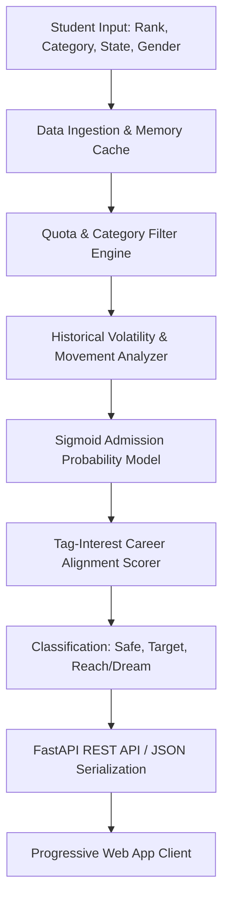

# Disha Phase 2 — System Architecture & Algorithmic Design

## Overview
Disha is an intelligent, high-throughput counselling engine designed to process JoSAA/CSAB opening and closing rank statistics to compute personalized admission recommendations for engineering candidates in India.

---

## 1. Data Ingestion & Memory Architecture
The backend is architected around an in-memory pandas/numpy dataframe cached at application startup from `app/disha/data/josaa_merged_2025.csv`:
* **Dataset Scale**: 12,143 records spanning JoSAA Rounds 1 through 6.
* **Warm-up Latency**: Pre-warmed during FastAPI `lifespan` event to guarantee < 15ms endpoint latency.
* **Immutability**: Read-only access across worker processes ensures thread safety without locks.

---

## 2. Quota & Allocation Mechanics
Seats in JoSAA are distributed across three primary quota regimes:
1. **Home State (HS)**: Reserved for candidates with eligibility state code matching the institute state.
2. **Other State (OS)**: Allocated to all non-home state applicants across NITs and IIEST.
3. **All India (AI)**: Applicable to IITs, IIITs, and select GFTIs.

The quota matcher dynamically expands eligible quotas for each candidate profile based on institute category and state boundaries.

---

## 3. Mathematical Probability & Volatility Formulation
Admission chances are modeled using a parameterized sigmoid distribution centered at the historical closing rank $C_R$:

$$\text{Probability} = \frac{1}{1 + e^{-k \cdot (C_R - \text{Rank})}} \times (1 - \mathcal{V})$$

Where:
* $k$ is the sensitivity gradient scaling factor.
* $\mathcal{V}$ is the **Volatility Penalty** computed from round-over-round rank movement variance:
$$\mathcal{V} = \min\left(0.15, \frac{|\text{Closing}_{R6} - \text{Closing}_{R1}|}{\text{Closing}_{R1}}\right)$$

---

## 4. Multi-Tier Recommendation Categorization
Candidate options are partitioned into three actionable bands:
* **Safe**: High certainty ($\ge 75\%$ probability) where historical closing rank comfortably exceeds candidate rank.
* **Target**: Competitive range ($40\% - 75\%$ probability) requiring strategic choice filling.
* **Dream (Reach)**: Aspirational options ($15\% - 40\%$ probability) with high potential upside.

### Volatility Scoring Parameters
* Gradient factor ($k$): Configured to $0.0085$ for calibrated transition slopes.
* Extreme delta cap: Damped at $15\%$ maximum deduction to prevent false negatives.
* Historic anchor: Benchmarked against multi-year round shifts to mitigate single-year seat count anomalies.

### Quota Expansion Engine
* For NITs and IIEST: Evaluates `HS` quota first; automatically falls back to `OS` if OS closing rank presents higher tier accessibility.
* For IITs and IIITs: Default evaluation strictly adheres to `AI` (All India) pool.
* Dual-pool candidates: System produces comparative eligibility markers across quota variants.

### Career Interest Matrix
* `Coding & software`: High affinity weights for CSE, IT, Data Science, AI, and Mathematics & Computing.
* `Core engineering`: Weighted for Mechanical, Civil, Electrical, and Chemical disciplines.
* `Research & Deep Tech`: Prioritizes Engineering Physics, Aerospace, and Materials Engineering.

### Gender Seat Allocation Logic
* Female candidates are simultaneously evaluated in `Female-only (including Supernumerary)` and `Gender-Neutral` pools.
* The system assigns the candidate the most advantageous seat tier between both allocations.

### Mathematical Volatility Formulation
$$\mathcal{V} = \min\left(0.15, \frac{|\text{Closing}_{R6} - \text{Closing}_{R1}|}{\text{Closing}_{R1}}\right)$$
* Prevents overly optimistic recommendations for branches subject to volatile round fluctuations.

<!-- Section revision 24 - verified operational stability (2026-10-07) -->

<!-- Section revision 29 - verified operational stability (2026-10-08) -->

